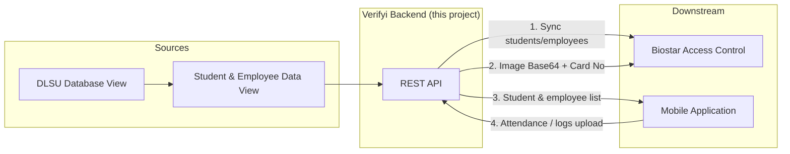
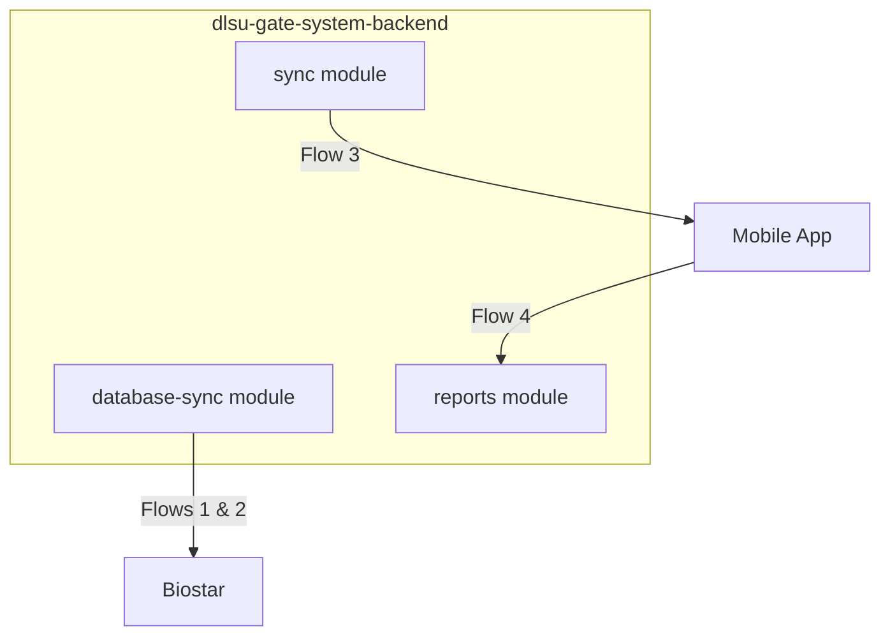
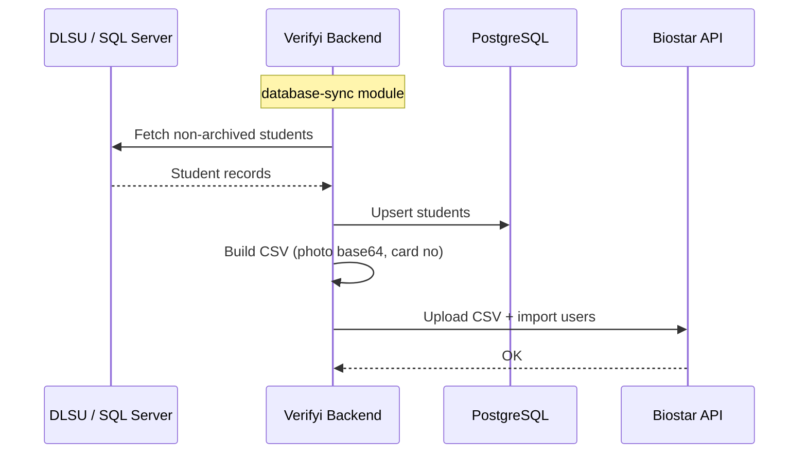

# Verifyi Backend – System Architecture (Share with Colleagues)

**Verifyi Backend** = this project (`dlsu-gate-system-backend`). It is the central backend for the DLSU gate system.

---

## High-level flow

---

## What each flow does

| # | Flow | Direction | Purpose |
|---|------|-----------|--------|
| 1 | **Sync Students & Employees** | Backend → Biostar | Push student/employee records from our DB to Biostar so access control works. |
| 2 | **Image Base64 + Card No (decimal)** | Backend → Biostar | Send face/photo and card number data so Biostar can do face/card recognition. |
| 3 | **Student & Employee List Sync** | Backend → Mobile | Give the mobile app the list of non-archived students/employees (e.g. for offline sync). |
| 4 | **Attendance / Logs Upload** | Mobile → Backend | Mobile app sends attendance or event logs to the backend for reporting. |

---

## Where it lives in this repo

| Flow | Module | Main entry points |
|------|--------|--------------------|
| **1 & 2** (to Biostar) | `src/database-sync/` | Scheduled sync (SQL Server → PostgreSQL → CSV → Biostar). Manual: `POST /database-sync/sync`, Biostar upload uses CSV with image + card. |
| **3** (list to mobile) | `src/sync/` | `GET /sync/students` – returns non-archived students for mobile. |
| **4** (logs from mobile) | `src/reports/` | Report creation (e.g. from mobile with `device: "Mobile App"`) – attendance/logs. |

---

## Data path (DLSU → Biostar)

- **Scheduled:** Runs at configured times (e.g. 09:00, 21:00).
- **Manual:** `POST /database-sync/sync` (and Biostar sync for photos: `POST /database-sync/biostar/sync`).

---

## Quick reference

- **Verifyi Backend** = this repo (`dlsu-gate-system-backend`).
- **Flows 1 & 2** = `src/database-sync/` (DLSU → Backend → Biostar).
- **Flow 3** = `src/sync/` (student/employee list to mobile).
- **Flow 4** = `src/reports/` (attendance/logs from mobile).

*Temporary doc for sharing with colleagues. You can move or rename this file as needed.*
